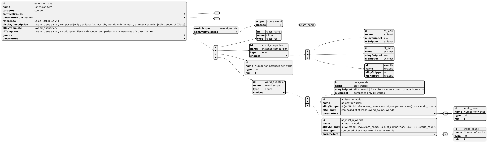

# Simulation Scenarios
## Example
An example of the structure of a scenario definition following the schema is included below:
Created using [PlantUML](https://editor.plantuml.com/uml/xPSzRzim48Pt_ug3ihI0uJQffq0M0gH1aQMB2tGm186Hw8G5HQea1KTrzTzBKjO7zM4R3jgf7WAPz-huyFZowDn9XOJw8JcRxMTWFnv9l5lmyAl2J1BE8ab-OMzUHnbAiOa_r75OE_4OAVpCHM4qCMTQf3f1phQKnEgBu7acjMGJDh4C2PrQON7FcLG24QPw2e6tM60Ms_dNY689xsu-NY_VmwV5Sd6pMBOJ9KHc51MViOm5oPJ6DEyymWun1Og3n1WGIAL18UPfnYLEOCCPBU0380KK8wcgnvHB5S9J0JikQ29XHzGBR8OQ_OHVKQne4SA6XK3qAf26bS2tiBcdICfmqH8YIddn3QSQKza5-RwT8FgPQqQo9LW4GQVijAiTNyXOXWhNzsEUCnMPfI91z7RhYE-RlmwcrXdEo6no47HedtCa4hCTjKlqc9ri7VFCmRSJTSWDEsSFQQOAMmFiPj5XMQUGFCMHpT9vsxYcUM_J6Qu35jRh1CBckJmybKEJkTaSdih_dTmEJEr_knWtf8fg7TMhsgqjLJa_EbTlSyPdV3pi54m9w_anozDU1LyuYKSgk7U-DJn8HTRSJXA7fRR_K65zlMOaox0ooc0raeLs14qgHrNEpmGrH-yevxYWZxdoJsFQJ1TG7jh2DEMaO41v0h9Ev4AEdusZZfomuDSyVSB2T8gsRMHwOEJGrcOapAs-bnBJYw_F1Ebtj76kxqO5LIFvEqV2N0rLRvBJ-sZlZobHVo_rTzZTGeN-6wvs2xVx7cdQ9rpGN6YMfxcvBZnWzd16xEJYcnkHdLs2g_s51IWXMC7qZNEyADlsWk-bc0IVk3QcYjSfO2V_8ArJllPeJK1OzTIfQWJzqrL_ojv8U9aPJ0iypmls9z4_iSBAVviLBEb_9moZmnzIrKWvkyCiiVyq_040)


Schema for OntoUML simulation scenario definitions. Each scenario defines an Alloy template and corresponding natural-language template and their parameters, to be replaced render time.

### Type: `object`

> ⚠️ Additional properties are not allowed.

| Property | Type | Required | Possible values | Description |
| -------- | ---- | -------- | --------------- | ----------- |
| version | `const` | ✅ | `1.0` | Schema version (1.1.0: camelCase JSON property names). |
| scenarios | `array` | ✅ | [Scenario](#scenario) | List of scenarios. |
| conflictGroups | `object` | ✅ | object | Catalogue with groups of mutually exclusive scenarios. Keys are the ids referenced from each scenario's `conflictGroups` array. Two scenarios are mutually exclusive iff their `conflictGroups` arrays share a key defined here. |


---

# Definitions

## Scenario

A single user-selectable scenario with its own Alloy and natural-language templates.

#### Type: `object`

> ⚠️ Additional properties are not allowed.

| Property | Type | Required | Possible values | Description | Examples |
| -------- | ---- | -------- | --------------- | ----------- | -------- |
| id | `string` | ✅ | string | Globally unique scenario identifier. | ```branch_depth``` |
| name | `string` | ✅ | string | Human-readable name of the scenario. | ```Branch Depth``` |
| category | `string` | ✅ | Length: `string >= 1` | Catalogue tag used only to group scenarios in the GUI picker | ```branch```, ```content```, ```experiment``` |
| conflictGroups | `array` | ✅ | string | Ids of mutual-exclusion groups this scenario belongs to; each must be a key of the top-level `conflictGroups` catalogue. Required (empty array allowed) so authors must explicitly consider whether the scenario needs any. | ```[]```, ```['world_shape']``` |
| displayDescription | `string` | ✅ | string | Hand-authored sentence shown in the GUI's scenario description box, following Sales (2014)'s bracketed-slot convention (`[at least / at most / exactly]`, `[n]`, `[Class]`). Kept separate from `naturalLanguageTemplate` for documentation, and because the heavily factored scenarios are compex to derive a readable preview from. | ```I want to see a story composed [at least / at most / exactly] of [n] consecutive worlds.``` |
| alloyTemplate | `string` | ✅ | string | Alloy constraint template with <<id>> expressions. The root may be either an explicit formula (e.g. 'all w: World | ...') or a placeholder whose selected enum choice expands to a full formula (e.g. '<<world_quantifier>>'). | ```all w: World | #w.exists >= <<n>>```, ```<<world_quantifier>>``` |
| naturalLanguageTemplate | `string` | ✅ | string | Natural-language template with <<id>> expressions to render according to argument choices. | ```I want to see a story composed of at least <<n>> consecutive worlds.``` |
| parameterConstraints | `array` | ✅ | [ParameterConstraint](#parameterconstraint) | Constraints on parameter-combinations within a scenario, e.g. disallowing two `class_ref` parameters to point to the same class. Required (empty array allowed) so authors must explicitly consider whether the scenario needs any. | ```[]```, ```[{'type': 'distinct', 'params': ['class1', 'class2']}]```, ```[{'type': 'distinct', 'params': ['common_type', 'class1', 'class2']}]``` |
| reference | `string` |  | string | Pointer to source material if applicable. Not consumed by the runtime. | ```Sales (2014) 3.4.1.4``` |
| parameters | `array` |  | [Parameter](#parameter) | The scenario's parameters. Every `<<id>>` placeholder in the templates must be backed by a top-level parameter or a sub-parameter of the currently-selected enum choice. |  |
| guards | `object` |  | [Guards](#guards) |  |  |

## Parameter

A placeholder for a user-supplied value substituted into `alloyTemplate` and `naturalLanguageTemplate`. Type-specific fields and constraints (e.g. `min`/`max`/`default` only on `int`, `choices` required on `enum`) are documented per-field and enforced by the Kotlin loader, rather than in the schema.

#### Type: `object`

> ⚠️ Additional properties are not allowed.

| Property | Type | Required | Possible values | Description | Examples |
| -------- | ---- | -------- | --------------- | ----------- | -------- |
| id | `string` | ✅ | string | Identifier used to reference this parameter (e.g. id `n` is referenced as `<<n>>`); must be unique within its scenario. | ```n``` |
| name | `string` | ✅ | string | Human-readable name of this parameter. | ```Number of consecutive worlds``` |
| type | `string` | ✅ | `int` `class_ref` `association` `enum` | Determines the input widget. | ```int``` |
| min | `integer` |  | integer | Minimum allowed value (int parameters only). | ```1``` |
| max | `integer` |  | integer | Maximum allowed value (int parameters only). |  |
| default | `integer` |  | integer | Default value (int parameters only). | ```3``` |
| choices | `array` |  | [EnumChoice](#enumchoice) | Available options (required for enum type). |  |
| sourceClassParam | `string` |  | string | (association parameters only) Id of the class_ref parameter playing the source-endpoint role; may equal `targetClassParam` for self-loop associations. | ```class1```, ```class_name``` |
| targetClassParam | `string` |  | string | (association parameters only) Id of the class_ref parameter playing the target-endpoint role; may equal `sourceClassParam` for self-loop associations. | ```class2```, ```class_name``` |

## ParameterConstraint

Constraint on parameter-combinations within a scenario, e.g. disallowing two `class_ref` parameters to point to the same class.

#### Type: `object`

> ⚠️ Additional properties are not allowed.

| Property | Type | Required | Possible values | Description | Examples |
| -------- | ---- | -------- | --------------- | ----------- | -------- |
| type | `string` | ✅ | `distinct` | `distinct` requires the listed parameters to resolve to pairwise different values. |  |
| params | `array` | ✅ | string | List of parameters (ids) that need to resolve to different values. Each must match a parameter id on the enclosing scenario. | ```['class1', 'class2']```, ```['common_type', 'class1', 'class2']``` |

## Guards

Guards to prevent the solver from returning vacuously-true instances. Defining sets that can't be empty etc.

#### Type: `object`

> ⚠️ Additional properties are not allowed.

| Property | Type | Required | Possible values | Description | Examples |
| -------- | ---- | -------- | --------------- | ----------- | -------- |
| worldScope | `integer` or `string` |  | Length: `string >= 1` or `1 <= x ` | Minimum number of World atoms required to simulate this scenario. | ```2```, ```4```, ```<<world_count>>``` |
| nonEmptyClasses | `object` |  | [NonEmptyClasses](#nonemptyclasses) |  |  |

## NonEmptyClasses

Class_ref parameters of the scenario whose chosen class must have a non-empty extension at the given scope.

#### Type: `object`

> ⚠️ Additional properties are not allowed.

| Property | Type | Required | Possible values | Description | Examples |
| -------- | ---- | -------- | --------------- | ----------- | -------- |
| scope | `string` | ✅ | [NonEmptyScope](#nonemptyscope) |  |  |
| classes | `array` | ✅ | string | Ids of class_ref parameters whose chosen class must be non-empty at the declared `scope`. | ```['class1']```, ```['class1', 'class2']```, ```['common_type']``` |

## NonEmptyScope

Quantifier scope at which each class/relation must be non-empty. `per_world` emits `all w: World | some w.<X>` (use when the scenario universally quantifies over worlds and an empty world would let an inner universal hold vacuously); `some_world` emits `some w: World | some w.<X>` (use when the scenario only meaningfully refers to at least one world).

#### Type: `string`

**Possible Values:** `per_world` or `some_world`

## EnumChoice

Choice for an enum-type parameter. A choice may declare its own conditional sub-parameters.

#### Type: `object`

> ⚠️ Additional properties are not allowed.

| Property | Type | Required | Possible values | Description | Examples |
| -------- | ---- | -------- | --------------- | ----------- | -------- |
| id | `string` | ✅ | string | Unique identifier for this choice within the parameter. | ```at_least``` |
| name | `string` | ✅ | string | Human-readable name. | ```at least``` |
| alloySnippet | `string` | ✅ | string | Alloy fragment substituted wherever the parameter's `<<id>>` placeholder appears in `alloyTemplate`. May contain its own placeholders, resolved in subsequent passes. | ```>=``` |
| naturalLanguageSnippet | `string` | ✅ | string | Natural-language fragment substituted wherever the parameter's `<<id>>` placeholder appears in `naturalLanguageTemplate`. May contain its own placeholders. | ```at least``` |
| parameters | `array` |  | [Parameter](#parameter) | Optional sub-parameters that only become active while this choice is selected. They share the scenario's flat namespace and must not collide with top-level parameter ids. |  |

## _TemplateFunctions

Documentation-only. Lists the template functions recognised inside `<<...>>` placeholders in Alloy template fields. Function arguments accept simple arithmetic on parameter names (n, n+1, n-1). Implementation lives in the Kotlin codebase.

#### Type: `object(?)`

| Property | Type | Required | Possible values | Description | Examples |
| -------- | ---- | -------- | --------------- | ----------- | -------- |
| world_vars(n) | `string` |  | string | Comma-separated world variable names: 'w1, w2, ..., wn'. | ```world_vars(3) -> w1, w2, w3``` |
| world_chain(n) | `string` |  | string | Predicate chaining world variables w1 through wn via `next`. | ```world_chain(3) -> w2 in w1.next and w3 in w2.next``` |
| x_vars(n) | `string` |  | string | Comma-separated element variable names: 'x1, x2, ..., xn'. | ```x_vars(3) -> x1, x2, x3``` |
| x_chain(n, association) | `string` |  | string | Predicate chaining element variables x1 through xn via the given association parameter. | ```x_chain(3, relatedTo) -> x2 in relatedTo[x1, w] and x3 in relatedTo[x2, w]``` |
| all_classes_at_least(n) | `string` |  | string | Conjunction `#w.C1 >= n and #w.C2 >= n and ...` over every endurant class; must be used inside a scope binding `w` to a World. | ```all w: World | <<all_classes_at_least(2)>> -> all w: World | #w.Person >= 2 and #w.Detective >= 2 and ...``` |
| all_associations_at_least(n) | `string` |  | string | Conjunction `#w.r1 >= n and #w.r2 >= n and ...` over every association; must be used inside a scope binding `w` to a World. | ```all w: World | <<all_associations_at_least(1)>> -> all w: World | #w.involvesdetective >= 1 and #w.manages >= 1 and ...``` |
| neighbors_nonempty(mc_alloy_name, k) | `string` |  | string | Conjunction `#w.C1 >= 1 and #w.C2 >= 1 and ...` over every endurant class within `k` undirected hops (over associations and generalisations) of the main-concept class `mc_alloy_name`. Must be used inside a scope binding `w` to a World. | ```all w: World | <<neighbors_nonempty(class_name, 2)>> -> all w: World | #w.Detective >= 1 and #w.Interrogation >= 1 and ...``` |


---

Markdown generated with [jsonschema-markdown](https://github.com/elisiariocouto/jsonschema-markdown).
